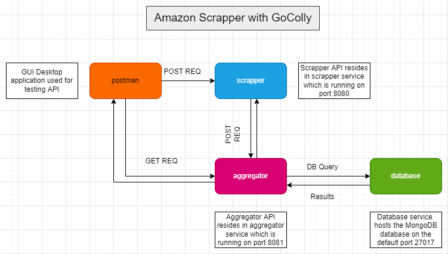
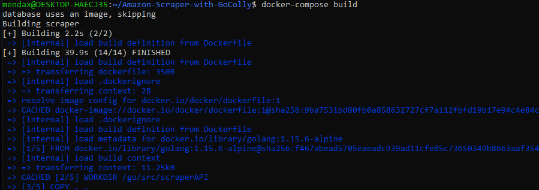
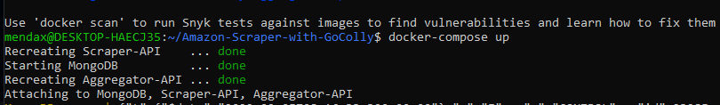
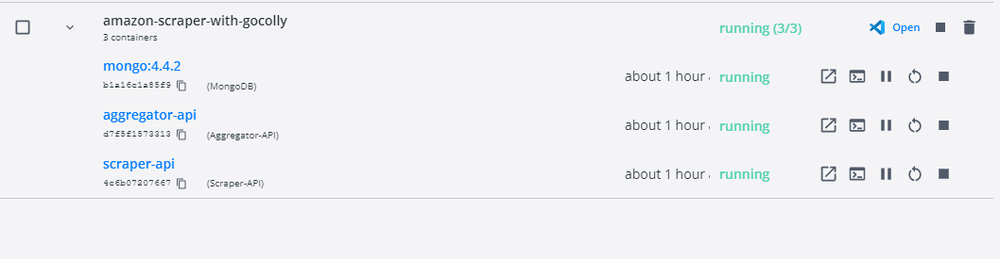
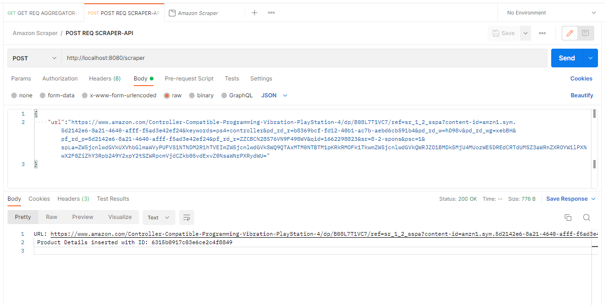
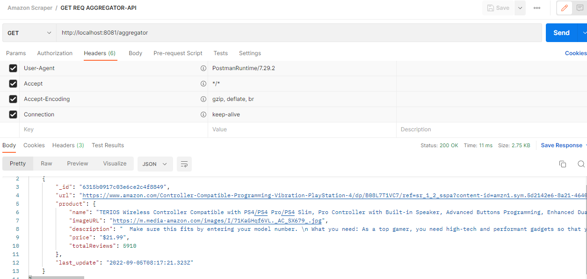

# Amazon-Scraper-with-GoColly

Application that consists of 2 services - Scraper and Aggregator, and MongoDB as the document store. 



## Objective
>**Note**: Below services are containerized into two different images.

1. Scraper Service - This will scrape an Amazon Web Page given its URL.
	-  Fetch details such as Name, Image URL, Description and Price.
	- Utilize [Colly](http://go-colly.org) framework for scraping.
	- Call Aggregator Service to persist the above scraped data in a document store database.
2. Aggregator Service - This take in the payload from the scraper service and update the database.
	- Write/Update the payload into the database which is MongoDB in our case.
	- Send back a status with details such as URL and ID.


## Local Configuration
> **Note**: I have developed on Windows 10 x64 bit + WSL2 Ubuntu-20.04 using Docker-Desktop v 4.9.1

|        Software        |Version                      
|----------------|-------------------------------|
|Go |`'1.13'`            |
|Docker|`"20.10.16, build aa7e414"`                      |
|MongoDB|` 4.4.2`|


##  API Endpoints

**Sno.** | **Port** | **Method** | **URL** | **REQ BODY** | **Info** | 
-------: | :------: | :--------- | :-----: | :-----------: | :---------- |
1 | 8080 | POST | [localhost:8080/scraper](http://localhost:8080/scraper) | Amazon Page URL | Colly visits the mentioned URL and scrapes the required data. |
2 | 8081 | POST | [localhost:8081/aggregator](http://localhost:8081/aggregator) | Product Details in JSON Format | It could either insert/update in the database. |
3 | 8081 | GET | [localhost:8081/aggregator](http://localhost:8081/aggregator) | NA | Returns all the records from the collection.|


## How to run locally?
1. ``` git clone https://github.com/jerinthomas1404/Amazon-Scraper-with-GoColly.git ```
2. ``` docker-compose build ```
3. ``` docker-compose up -d ```
4. Using POSTMAN/Other Application send a POST request to scraper API with a url in the body as JSON.

## Screenshots









